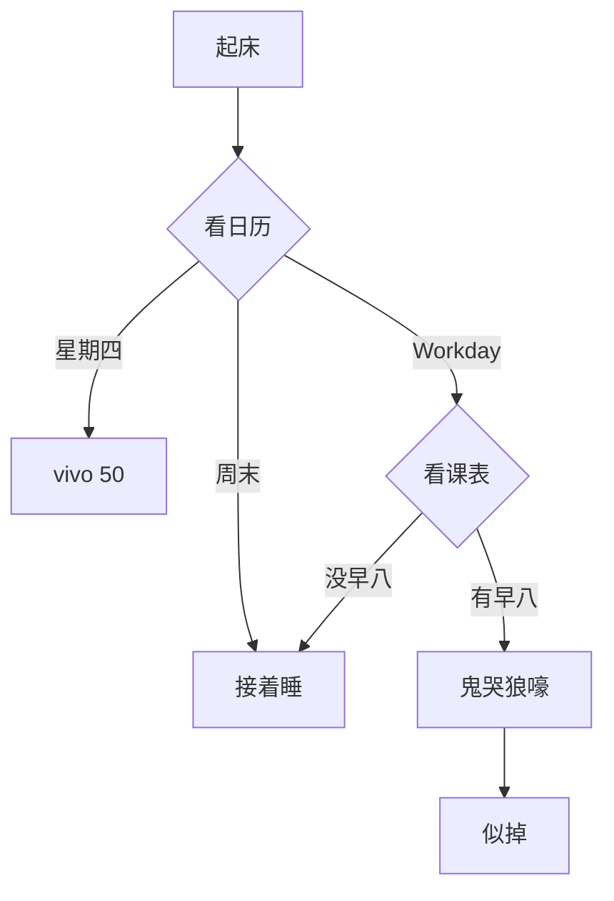

# 一级标题
## 二级标题
###### 六级标题

段落用若干空行分隔

**粗体字** __粗体字__
*斜体字* _斜体字_
***粗斜体字*** ___粗斜体字___
==bulingbulig的高亮文本✨==

无序列表(- + *均可)
- 1
- 2
    - 2.1
    - 2.2
- 3

有序列表(数字+.)
1. 1
2. 2
    1. 2.1
    2. 2.2
3. 3

[链接](https://github.com/AHuangMeow)
[还可以为链接添加标题](https://github.com/AHuangMeow "AHuang's personal profile")


行内代码 `println!("Muxi")`
代码块

```rust
use muxi::senior;

fn main() -> ! {
    loop {
        senior.flog();
    }
}
```

> 引用块
> 可以有多行
> > 可以嵌套

分割线

---
***
___

表格

| 左对齐 | 居中  | 右对齐 |
| :-- | :-: | --: |
| 格子  | 格子  |  格子 |
| 格子  | 格子  |  格子 |

~~KFC krz thur v 50~~

\*某些字符需转义喔\*

任务列表
- [x] 做好辣
- [ ] 不是不做，而是缓做，慢做，有节奏地做，要先做带动后做(?

脚注[^1]
[^1]: KFC krz thur v 50

Latex $sin(114514)=sin(5201314)$

一大坨Latex

$$
\int_{-\infty}^{\infty} e^{-x^2} dx = \sqrt{\pi}
$$

Mermaid流程图



↓这里有注释
<!-- 棍木 -->

嵌入HTML
<details>
<summary>🎁</summary>
🌹
</details>

[🏠点我回家](./Week1.md)
