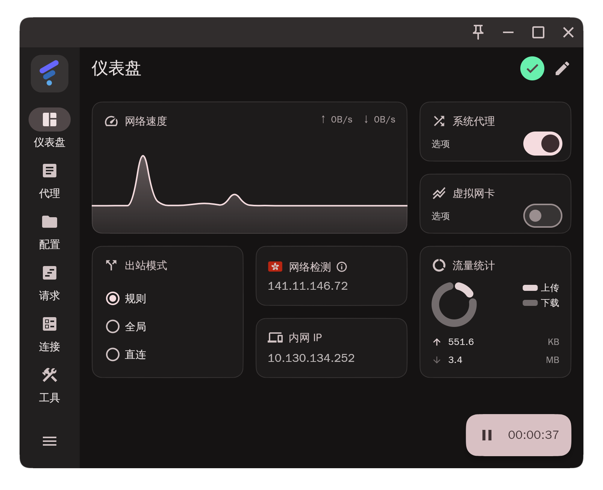
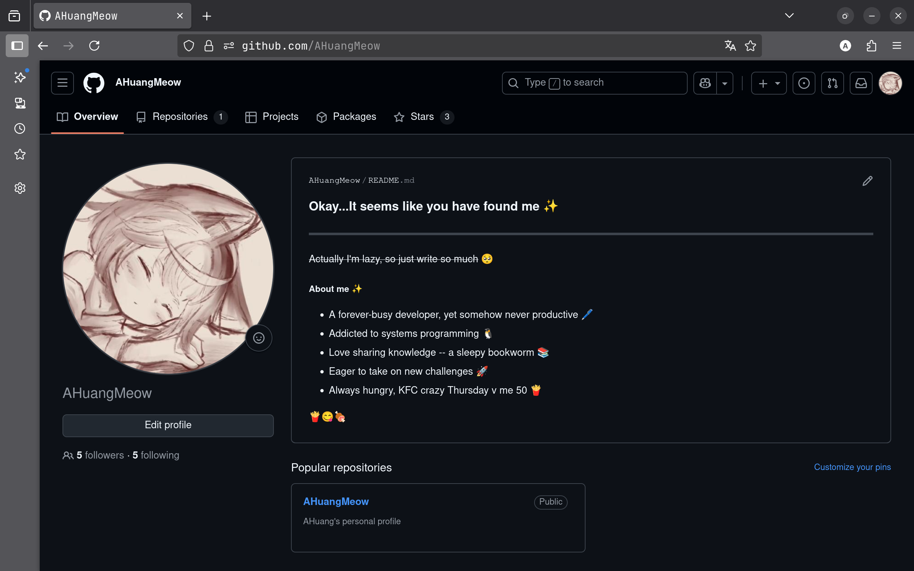

### 目标

- [科学上网](#科学上网)
- [Markdown](#Markdown)
- [版本控制](#版本控制)
- [Golang语法巩固](#Golang语法巩固)

---
### 科学上网

#### 客户端

使用Flclash作为客户端

```shell
#系统环境：Arch Linux
#需要工具：paru
paru -Syu && paru -S flclash-bin
```


#### 机场

厂商选择ikuuu，注册并登录后购买了一份代理并导入了Flclash. 经测试，能正常登入github.



---

### Markdown

Markdown是一种轻量级标记语言<font color="gray">(用来写笔记简直不要太好用🥺)</font>，以下是我目前所学到的一些Markdown语法

[🚀点我跃迁](./MarkdownDemo.md)

---

#### 版本控制

我最常用的版本控制软件是git, 一些基本用法

```shell
# 下载安装
# 需要工具：paru
paru -Syu && paru -S git

# 设置全局用户名
git config --global user.name "AHuang"
# 设置全局邮箱
git config --global user.email "ahuangmeow@qq.com"

# 设置局部用户名
git config user.name "AHuang"
# 设置局部邮箱
git config user.email "ahuangmeow@qq.com"

# 初始化新仓库
git init

# 创建.gitignore文件以忽略无需跟踪的文件

# 查看暂存区状态
git status

# 查看具体更改
git diff

# 添加文件到暂存区
git add <file>

# 添加所有已更改文件到暂存区，不要滥用
git add .

# 提交更改
git commit -m "Description"

# 添加&提交已跟踪文件
git commit -am "Description"

# 查看分支
git branch

# 创建分支
git brabch <branch>

# 切换分支
git checkout <branch>

# 创建+切换分支
git checkout -b <branch>

# 合并分支到当前分支
git merge <branch>

# 删除分支
git branch -d <branch>

# 查看提交历史
git log

# 查看特定文件的修改历史
git log -p <file>

# 撤销工作区的修改，不可redo，慎用
git checkout -- <file>

# 从暂存区移除文件
git restore --staged <file>

# 撤销最近一次提交并创建撤销提交
git revert HEAD

# 回退到指定提交
git reset --hard <commit-hash>

# 暂存当前工作
git stash

# 暂存列表
git stash list

# 恢复暂存
git stash pop

# 清空暂存
git stash clear

# 创建标签
git tag <tag>

# 查看标签
git tag

# 删除标签
git tag -d <tag>

# 克隆仓库
git clone <url>
git clone --depth=1 <url> #有时也没必要啥都往下拉

# 查看远程仓库信息
git remote -v

# 添加远程仓库
git remote add origin <url>

# 修改远程仓库地址
git remote set-url origin <url>

# 删除远程仓库
git remote remove origin

# 首次推送
git push -u origin <branch>

# 推送特定分支
git push origin <branch>

# 推送所有分支
git push --all origin

# 拉取&合并
git pull

# 拉取特定分支
git pull origin <branch>

# 仅拉取
git fetch
```

---

### Golang语法巩固

#### 实验一

>给定s := make([]byte, 5)，那么len(s) 和 cap(s) 分别是多少？令s = s[2:4]，len(s) 和 cap(s) 又分别是多少？

```go
package main

import "fmt"

func main() {
	s := make([]byte, 5)
	fmt.Println(len(s), cap(s))

	s = s[2:4]
	fmt.Println(len(s), cap(s))
}
```

运行结果

```
5 5
2 3
```

尝试分析

- `s := make([]byte, 5)` 在这一句中，该语句向操作系统动态申请了一片长度为5字节的堆内存，并初始化为\[0 0 0 0 0\], s作为切片类型本质上是胖指针，指向该内存区域的首地址并记录len = 5，cap = 5.
- s = s\[2:4\]，此时s不再指向\[<font color="red">0</font> 0 0 0 0\]，而是指向\[0 0 <font color="red">0</font> 0 0\], 并记录len = 4 - 2 = 2，但是cap的计算以该内存区域的边界为准，因而cap = 5 - 2 = 3
- 思考：len与cap的区别. len标记的是以s指向的地址为始，<font color="yellow">可访问</font>区域的大小；cap标记的是以s指向的地址为始，<font color="yellow">已分配</font>区域的大小. 在上述例子中，在执行`s = s[2:4]`后，尽管cap = 3，但是试图访问s\[2\]仍会发生**数组越界**错误；若执行`s = append(s, 0)`，由于cap > len，有空闲容量，不会触发新的内存分配

#### 实验二

>比较**字符串**"hello，世界"的**长度**和for range该字符串的循环**次数**

```go
package main

import "fmt"

func main() {
	s := "hello，世界"
	fmt.Println(len(s))

	cnt := 0
	for _, _ = range s {
		cnt++
	}
	fmt.Println(cnt)
}
```

运行结果

```
14
8
```

尝试分析

- len(s)实际上计算了字符串s所占用的字节数，在字符串"hello，世界"中，共五个英文字符，三个中文字符<font color="gray">(逗号为中文逗号)</font>，英文字符占用一字节，中文字符占用三字节，共计5 * 1 + 3 * 3 = 14
- for range语法会按字符迭代字符串，总计8字符，因此循环次数为8