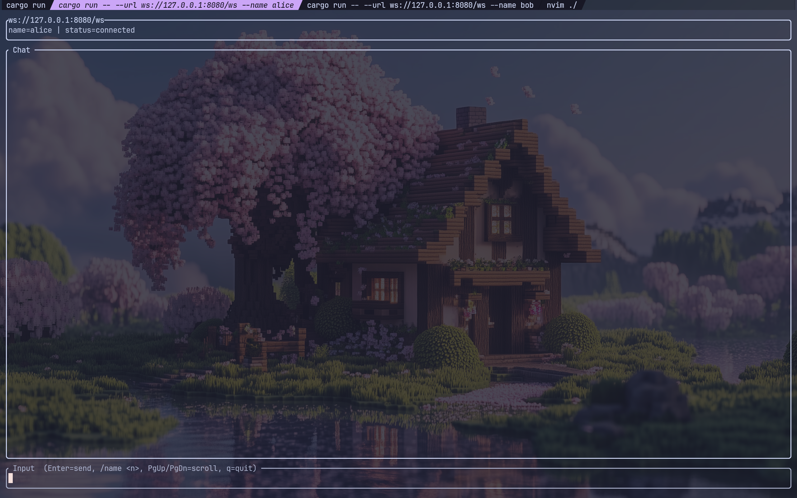
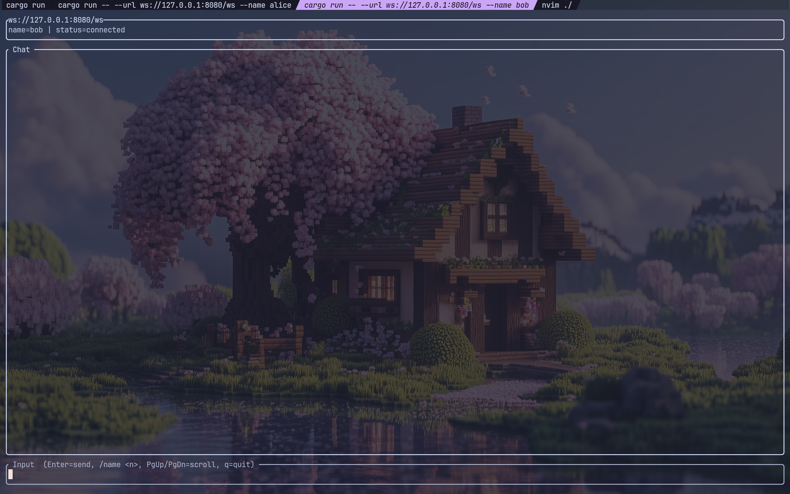
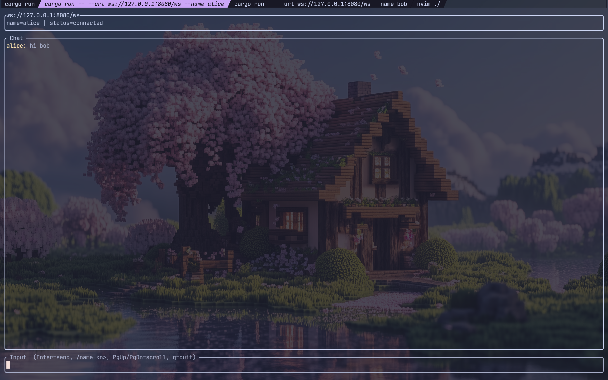
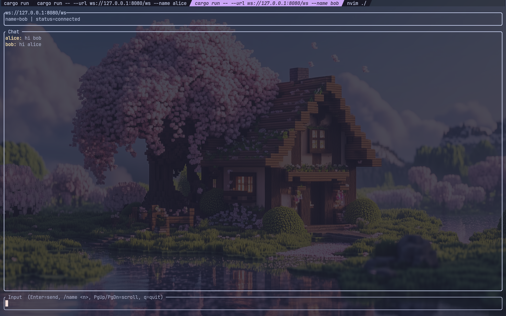

### 主线任务

1. [学习如何使用代码操作redis](#Redis)
2. [使用SSE实时输出当前时间](#SSE)
3. [使用WebSocket实现一个聊天室](#聊天室)

---

### Redis

```rust
use anyhow::Context;
use redis::Commands;
use std::collections::HashMap;
use std::time::{SystemTime, UNIX_EPOCH};

fn now_suffix() -> u128 {
    SystemTime::now()
        .duration_since(UNIX_EPOCH)
        .expect("clock went backwards")
        .as_nanos()
}

fn main() -> anyhow::Result<()> {
    // 连接至redis
    let client = redis::Client::open("redis://127.0.0.1:6379/").context("open redis client")?;
    let mut con = client.get_connection().context("connect to redis")?;

    let prefix = format!("demo:{}:", now_suffix());

    println!("Redis demo prefix: {prefix}");
    println!("PING => {}", redis::cmd("PING").query::<String>(&mut con)?);

    // 1) String: SET / GET
    let k_hello = format!("{prefix}hello");
    let _: () = con.set(&k_hello, "world")?;
    let v_hello: String = con.get(&k_hello)?;
    println!("SET/GET {k_hello} => {v_hello}");

    // 2) Expire: SETEX / TTL / PERSIST
    let k_tmp = format!("{prefix}tmp");
    let _: () = con.set_ex(&k_tmp, "will-expire", 3)?;
    let ttl1: i64 = con.ttl(&k_tmp)?;
    println!("SETEX {k_tmp} 3s, TTL => {ttl1}");
    let persisted: bool = con.persist(&k_tmp)?;
    let ttl2: i64 = con.ttl(&k_tmp)?;
    println!("PERSIST => {persisted}, TTL => {ttl2} (-1 means no expire)");

    // 3) Conditional set: SETNX
    let k_lock = format!("{prefix}lock");
    let ok1: bool = con.set_nx(&k_lock, "owner-a")?;
    let ok2: bool = con.set_nx(&k_lock, "owner-b")?;
    let lock_val: String = con.get(&k_lock)?;
    println!("SETNX first={ok1}, second={ok2}, value={lock_val}");

    // 4) Exists / Rename / Del
    let exists_before: bool = con.exists(&k_hello)?;
    let k_hello2 = format!("{prefix}hello2");
    let _: () = con.rename(&k_hello, &k_hello2)?;
    let exists_after_old: bool = con.exists(&k_hello)?;
    let exists_after_new: bool = con.exists(&k_hello2)?;
    let deleted: i64 = con.del(&k_hello2)?;
    println!(
        "EXISTS before={exists_before}, after_rename old={exists_after_old} new={exists_after_new}, DEL => {deleted}"
    );

    // 5) Counter: INCR / INCRBY
    let k_counter = format!("{prefix}counter");
    let n1: i64 = con.incr(&k_counter, 1)?;
    let n2: i64 = con.incr(&k_counter, 10)?;
    println!("INCR/INCRBY {k_counter} => {n1} then {n2}");

    // 6) Hash: HSET / HGET / HGETALL
    let k_user = format!("{prefix}user:1");
    let _: () = con.hset(&k_user, "name", "alice")?;
    let _: () = con.hset(&k_user, "age", 18)?;
    let name: String = con.hget(&k_user, "name")?;
    let all: HashMap<String, String> = con.hgetall(&k_user)?;
    println!("HGET {k_user} name => {name}");
    println!("HGETALL {k_user} => {all:?}");

    // 7) List: RPUSH / LRANGE
    let k_list = format!("{prefix}list");
    let _: () = con.rpush(&k_list, "a")?;
    let _: () = con.rpush(&k_list, "b")?;
    let items: Vec<String> = con.lrange(&k_list, 0, -1)?;
    println!("RPUSH/LRANGE {k_list} => {items:?}");

    // 8) Set: SADD / SMEMBERS
    let k_set = format!("{prefix}set");
    let added: i64 = con.sadd(&k_set, vec!["x", "y", "y"])?;
    let members: Vec<String> = con.smembers(&k_set)?;
    println!("SADD {k_set} added={added}, SMEMBERS => {members:?}");

    // 9) Sorted set: ZADD / ZRANGE WITHSCORES
    let k_z = format!("{prefix}zset");
    let _: () = redis::cmd("ZADD")
        .arg(&k_z)
        .arg(10)
        .arg("tom")
        .arg(20)
        .arg("jerry")
        .query(&mut con)?;
    let zr: Vec<(String, f64)> = redis::cmd("ZRANGE")
        .arg(&k_z)
        .arg(0)
        .arg(-1)
        .arg("WITHSCORES")
        .query(&mut con)?;
    println!("ZADD/ZRANGE {k_z} => {zr:?}");

    // Cleanup: delete demo keys (non-destructive; no FLUSHDB).
    let keys: Vec<String> = redis::cmd("KEYS")
        .arg(format!("{prefix}*"))
        .query(&mut con)?;
    if !keys.is_empty() {
        let deleted: i64 = con.del(keys)?;
        println!("cleanup: DEL demo keys => {deleted}");
    }

    Ok(())
}
```

运行结果：

```text
Redis demo prefix: demo:1770295859075050224:
PING => PONG
SET/GET demo:1770295859075050224:hello => world
SETEX demo:1770295859075050224:tmp 3s, TTL => 3
PERSIST => true, TTL => -1 (-1 means no expire)
SETNX first=true, second=false, value=owner-a
EXISTS before=true, after_rename old=false new=true, DEL => 1
INCR/INCRBY demo:1770295859075050224:counter => 1 then 11
HGET demo:1770295859075050224:user:1 name => alice
HGETALL demo:1770295859075050224:user:1 => {"age": "18", "name": "alice"}
RPUSH/LRANGE demo:1770295859075050224:list => ["a", "b"]
SADD demo:1770295859075050224:set added=2, SMEMBERS => ["x", "y"]
ZADD/ZRANGE demo:1770295859075050224:zset => [("tom", 10.0), ("jerry", 20.0)]
cleanup: DEL demo keys => 7
```

---
### SSE

```rust
use actix_web::rt::time;
use actix_web::{App, HttpResponse, HttpServer, http::header, web};
use futures_util::stream;
use std::time::Duration;

async fn sse() -> HttpResponse {
    let event_stream = stream::unfold((), |_| async move {
        time::sleep(Duration::from_secs(1)).await;

        let payload = serde_json::json!({
            "ts": std::time::SystemTime::now()
                .duration_since(std::time::UNIX_EPOCH)
                .unwrap_or_default()
                .as_secs(),
        });
        let sse_frame = format!("data: {}\n\n", payload);
        Some((Ok::<_, actix_web::Error>(web::Bytes::from(sse_frame)), ()))
    });

    HttpResponse::Ok()
        .insert_header((header::CONTENT_TYPE, "text/event-stream"))
        .insert_header((header::CACHE_CONTROL, "no-cache"))
        .streaming(event_stream)
}

#[actix_web::main]
async fn main() -> std::io::Result<()> {
    HttpServer::new(|| App::new().route("/sse", web::get().to(sse)))
        .bind(("127.0.0.1", 8080))?
        .run()
        .await
}
```

测试：

```shell
curl -N http://127.0.0.1:8080/sse
```

运行结果：

```text
data: {"ts":1770296060}

data: {"ts":1770296061}

data: {"ts":1770296062}

data: {"ts":1770296063}

data: {"ts":1770296064}

data: {"ts":1770296065}
```

---

### 聊天室

```rust
use actix::prelude::*;
use actix_web::{App, Error, HttpRequest, HttpResponse, HttpServer, Responder, get, web};
use actix_web_actors::ws;
use serde::{Deserialize, Serialize};
use std::collections::HashMap;
use std::time::{Duration, Instant};

const MAX_TEXT_LEN: usize = 2048;
const HEARTBEAT_INTERVAL: Duration = Duration::from_secs(5);
const CLIENT_TIMEOUT: Duration = Duration::from_secs(15);

#[derive(Message)]
#[rtype(result = "()")]
struct WsText(pub String);

#[derive(Message)]
#[rtype(result = "usize")]
struct Connect {
    addr: Recipient<WsText>,
}

#[derive(Message)]
#[rtype(result = "()")]
struct Disconnect {
    id: usize,
}

#[derive(Message)]
#[rtype(result = "()")]
struct SetName {
    id: usize,
    name: String,
}

#[derive(Message)]
#[rtype(result = "()")]
struct Broadcast {
    from: usize,
    msg: String,
}

struct ChatServer {
    next_id: usize,
    sessions: HashMap<usize, Recipient<WsText>>,
    names: HashMap<usize, String>,
}

impl Default for ChatServer {
    fn default() -> Self {
        Self {
            next_id: 1,
            sessions: HashMap::new(),
            names: HashMap::new(),
        }
    }
}

impl Actor for ChatServer {
    type Context = Context<Self>;
}

impl ChatServer {
    fn name_of(&self, id: usize) -> String {
        self.names
            .get(&id)
            .cloned()
            .unwrap_or_else(|| format!("user_{id}"))
    }

    fn send_json(&self, to: usize, value: &impl Serialize) {
        if let Some(addr) = self.sessions.get(&to)
            && let Ok(text) = serde_json::to_string(value)
        {
            addr.do_send(WsText(text));
        }
    }

    fn broadcast_json(&self, value: &impl Serialize) {
        if let Ok(text) = serde_json::to_string(value) {
            for addr in self.sessions.values() {
                addr.do_send(WsText(text.clone()));
            }
        }
    }

    fn broadcast_json_except(&self, except: usize, value: &impl Serialize) {
        if let Ok(text) = serde_json::to_string(value) {
            for (id, addr) in &self.sessions {
                if *id == except {
                    continue;
                }
                addr.do_send(WsText(text.clone()));
            }
        }
    }
}

impl Handler<Connect> for ChatServer {
    type Result = usize;

    fn handle(&mut self, msg: Connect, _: &mut Context<Self>) -> Self::Result {
        let id = self.next_id;
        self.next_id += 1;

        self.sessions.insert(id, msg.addr);

        let welcome = ServerMsg::Welcome {
            id,
            name: self.name_of(id),
        };
        self.send_json(id, &welcome);

        let join = ServerMsg::Event {
            event: "join",
            id,
            name: Some(self.name_of(id)),
        };
        self.broadcast_json_except(id, &join);

        id
    }
}

impl Handler<Disconnect> for ChatServer {
    type Result = ();

    fn handle(&mut self, msg: Disconnect, _: &mut Context<Self>) {
        let existed = self.sessions.remove(&msg.id).is_some();
        self.names.remove(&msg.id);

        if existed {
            let leave = ServerMsg::Event {
                event: "leave",
                id: msg.id,
                name: None,
            };
            self.broadcast_json(&leave);
        }
    }
}

impl Handler<SetName> for ChatServer {
    type Result = ();

    fn handle(&mut self, msg: SetName, _: &mut Context<Self>) {
        let name = msg.name.trim().to_string();
        if name.is_empty() {
            let err = ServerMsg::Error {
                message: "name cannot be empty",
            };
            self.send_json(msg.id, &err);
            return;
        }

        self.names.insert(msg.id, name.clone());
        let join = ServerMsg::Event {
            event: "rename",
            id: msg.id,
            name: Some(name),
        };
        self.broadcast_json(&join);
    }
}

impl Handler<Broadcast> for ChatServer {
    type Result = ();

    fn handle(&mut self, msg: Broadcast, _: &mut Context<Self>) {
        let text = msg.msg.trim().to_string();
        if text.is_empty() {
            let err = ServerMsg::Error {
                message: "msg cannot be empty",
            };
            self.send_json(msg.from, &err);
            return;
        }

        let chat = ServerMsg::Chat {
            from: FromUser {
                id: msg.from,
                name: self.name_of(msg.from),
            },
            msg: text,
        };
        self.broadcast_json(&chat);
    }
}

#[derive(Deserialize)]
#[serde(tag = "type", rename_all = "lowercase")]
enum ClientMsg {
    Join { name: String },
    Chat { msg: String },
}

#[derive(Serialize)]
#[serde(tag = "type", rename_all = "lowercase")]
enum ServerMsg<'a> {
    Welcome {
        id: usize,
        name: String,
    },
    Event {
        event: &'a str,
        id: usize,
        #[serde(skip_serializing_if = "Option::is_none")]
        name: Option<String>,
    },
    Chat {
        from: FromUser,
        msg: String,
    },
    Error {
        message: &'a str,
    },
}

#[derive(Serialize)]
struct FromUser {
    id: usize,
    name: String,
}

struct WsSession {
    id: usize,
    hb: Instant,
    server: Addr<ChatServer>,
}

impl WsSession {
    fn new(server: Addr<ChatServer>) -> Self {
        Self {
            id: 0,
            hb: Instant::now(),
            server,
        }
    }

    fn start_heartbeat(&self, ctx: &mut ws::WebsocketContext<Self>) {
        ctx.run_interval(HEARTBEAT_INTERVAL, |act, ctx| {
            if Instant::now().duration_since(act.hb) > CLIENT_TIMEOUT {
                ctx.stop();
                return;
            }
            ctx.ping(b"ping");
        });
    }

    fn handle_text(&self, text: &str, ctx: &mut ws::WebsocketContext<Self>) {
        if text.len() > MAX_TEXT_LEN {
            let err = ServerMsg::Error {
                message: "message too long",
            };
            if let Ok(s) = serde_json::to_string(&err) {
                ctx.text(s);
            }
            return;
        }

        let parsed: Result<ClientMsg, _> = serde_json::from_str(text);
        let msg = match parsed {
            Ok(m) => m,
            Err(_) => {
                let err = ServerMsg::Error {
                    message: "invalid json",
                };
                if let Ok(s) = serde_json::to_string(&err) {
                    ctx.text(s);
                }
                return;
            }
        };

        match msg {
            ClientMsg::Join { name } => {
                self.server.do_send(SetName { id: self.id, name });
            }
            ClientMsg::Chat { msg } => {
                self.server.do_send(Broadcast { from: self.id, msg });
            }
        }
    }
}

impl Actor for WsSession {
    type Context = ws::WebsocketContext<Self>;

    fn started(&mut self, ctx: &mut Self::Context) {
        self.start_heartbeat(ctx);

        let addr = ctx.address().recipient::<WsText>();
        self.server
            .send(Connect { addr })
            .into_actor(self)
            .map(|res, act, ctx| match res {
                Ok(id) => act.id = id,
                Err(_) => ctx.stop(),
            })
            .wait(ctx);
    }

    fn stopping(&mut self, _: &mut Self::Context) -> Running {
        if self.id != 0 {
            self.server.do_send(Disconnect { id: self.id });
        }
        Running::Stop
    }
}

impl Handler<WsText> for WsSession {
    type Result = ();

    fn handle(&mut self, msg: WsText, ctx: &mut Self::Context) {
        ctx.text(msg.0);
    }
}

impl StreamHandler<Result<ws::Message, ws::ProtocolError>> for WsSession {
    fn handle(&mut self, item: Result<ws::Message, ws::ProtocolError>, ctx: &mut Self::Context) {
        match item {
            Ok(ws::Message::Ping(bytes)) => {
                self.hb = Instant::now();
                ctx.pong(&bytes);
            }
            Ok(ws::Message::Pong(_)) => {
                self.hb = Instant::now();
            }
            Ok(ws::Message::Text(text)) => {
                self.hb = Instant::now();
                self.handle_text(text.as_ref(), ctx);
            }
            Ok(ws::Message::Binary(_)) => {}
            Ok(ws::Message::Close(reason)) => {
                ctx.close(reason);
                ctx.stop();
            }
            Ok(ws::Message::Continuation(_)) => {
                ctx.stop();
            }
            Ok(ws::Message::Nop) => {}
            Err(_) => ctx.stop(),
        }
    }
}

struct AppState {
    server: Addr<ChatServer>,
}

#[get("/")]
async fn index() -> impl Responder {
    HttpResponse::Ok().body("ok")
}

async fn ws_route(
    req: HttpRequest,
    stream: web::Payload,
    data: web::Data<AppState>,
) -> Result<HttpResponse, Error> {
    ws::start(WsSession::new(data.server.clone()), &req, stream)
}

#[actix_web::main]
async fn main() -> std::io::Result<()> {
    let server = ChatServer::default().start();

    HttpServer::new(move || {
        App::new()
            .app_data(web::Data::new(AppState {
                server: server.clone(),
            }))
            .service(index)
            .route("/ws", web::get().to(ws_route))
    })
    .bind(("127.0.0.1", 8080))?
    .run()
    .await
}
```

使用效果：

alice进入


bob进入


alice发送“hi bob”


bob发送“hi alice”
