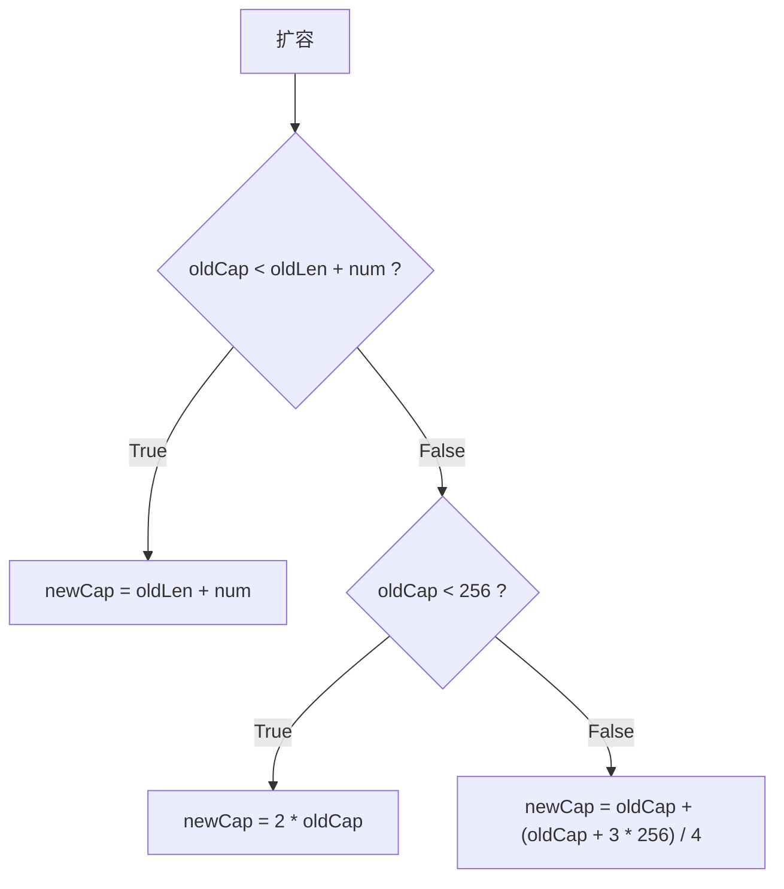
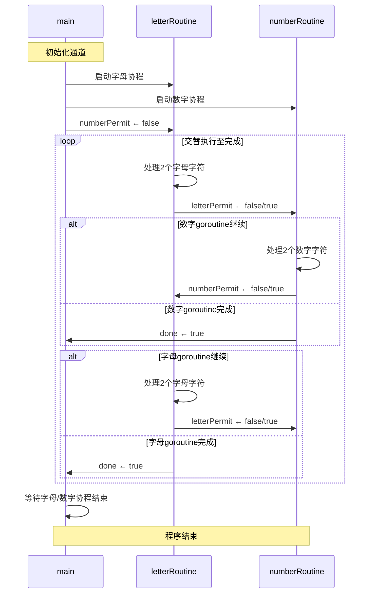

### 主线任务

1. map和slice内存扩容的区别 [🚀](#1.map和slice内存扩容的区别)
2. 结构体的比较 [🚀](#2.结构体的比较)
3. 利用闭包实现一个计数器 [🚀](#3.利用闭包实现一个计数器)
4. 解决可恶的panic [🚀](#4.解决可恶的panic)
5. 来和channel&goroutine玩耍♂ [🚀](#5.来和channel&goroutine玩耍♂)
6. 使用channel进行并发控制 [🚀](#6.使用channel进行并发控制)

---

### 1.map和slice内存扩容的区别

>map和slice内存扩容的区别

<font color="gray">注：以下内容仅针对go 1.18+</font>
#### 触发条件

- map: 溢出桶过多 | 元素数量过多
- slice: 执行append时，底层数组容量不足

#### 扩容策略

- map: 溢出桶过多时，发生等量扩容，实际上是一次“数据整理”；负载因子超过6.5时，分配约两倍大小的新桶数组并迁移数据
- slice: 见下图



#### 并发安全

二者扩容均非并发安全，需加锁保护

[🏠](#主线任务)

---

### 2.结构体的比较

>结构体的比较

若结构体所有字段均可进行相等性比较，则该结构体支持相等性比较

```go
package main

import "fmt"

type Senior struct {
    Name string
    Age int
}

func main() {
    sjn := Senior { "Sun Junnan", 20 }
    wyx := Senior { "Wu Yuxian", 22 }
    
    fmt.Println(sjn == wyx) // false
}
```

若结构体包含slice、map、func等不可比较字段，则该结构体不支持相等性比较

```go
package main

import "fmt"

type LittleDeng {
    Name string
    Hobbies []string
}

func main() {
    wjj := LittleDeng { "Wang Junjie", []string{"deepsleep", "kfc crz thur v 50"} }
    qzh := LittleDeng { "Qiu Zhenhao", []string{"coding", "battle with go"} }
    
    fmt.Println(wjj == qzh) // invalid operation: wjj == qzh (struct containing []string cannot be compared)
}
```

对于不支持相等性比较的结构体， 有以下方法实现相等性比较

```go
package main

import (
	"fmt"
	"reflect"
)

type LittleDeng struct {
	Name    string
	Hobbies []string
}

// 手动实现Equals方法
func (self *LittleDeng) Equals(other *LittleDeng) bool {
	if self.Name != other.Name {
		return false
	}
	// this is actually a pcs of s**t
	if !reflect.DeepEqual(self.Hobbies, other.Hobbies) {
		return false
	}

	return true
}

func main() {
	wjj := LittleDeng{"Wang Junjie", []string{"deepsleep", "kfc crz thur v 50"}}
	qzh := LittleDeng{"Qiu Zhenhao", []string{"coding", "battle with go"}}

	// 使用reflect.DeepEqual
	fmt.Println(reflect.DeepEqual(wjj, qzh)) // false

	fmt.Println(wjj.Equals(&qzh)) // false
}
```

---

### 3.利用闭包实现一个计数器

>利用闭包实现一个计数器

计数器实际上是一个函数，维护着一个内部的计数变量，并在每次调用该函数时自增该变量并返回

```go
package main

import "fmt"

func Counter() func() int {
	cnt := 0
	return func() int {
		cnt++
		return cnt
	}
}

func main() {
	// 初始化计数器实例
	counter := Counter()

	fmt.Println(counter())
	fmt.Println(counter())
	fmt.Println(counter())
	fmt.Println(counter())
	fmt.Println(counter())
}
```

#### 原理剖析

在Counter函数调用结束后，内部的cnt变量并没有被销毁，而是由一个闭包捕获并维持，得以实现计数器

[🏠](#主线任务)

---

### 4.解决可恶的panic

>思考以下程序在并发出现panic的原因，并解决

```go
package main

type message struct {
    Topic     string
    Partition int32
    Offset    int64
}

type FeedEventDM struct {
    Type    string
    UserID  int
    Title   string
    Content string
}

type MSG struct {
    ms        message
    feedEvent FeedEventDM
}

const ConsumeNum = 5

func main() {
    var consumeMSG []MSG
    var lastConsumeTime time.Time // 记录上次消费的时间
    msgs := make(chan MSG)

    //这里源源不断的生产信息
    go func() {
       for i := 0; ; i++ {
          msgs <- MSG{
             ms: message{
                Topic:     "消费主题",
                Partition: 0,
                Offset:    0,
             },
             feedEvent: FeedEventDM{
                Type:    "grade",
                UserID:  i,
                Title:   "成绩提醒",
                Content: "您的成绩是xxx",
             },
          }
          //每次发送信息会停止0.01秒以模拟真实的场景
          time.Sleep(100 * time.Millisecond)
       }
    }()

    //不断接受消息进行消费
    for msg := range msgs {
       // 添加新的值到events中
       consumeMSG = append(consumeMSG, msg)
       // 如果数量达到额定值就批量消费
       if len(consumeMSG) >= ConsumeNum {
          //进行异步消费
          go func() {
             m := consumeMSG[:ConsumeNum]
             fn(m)
          }()
          // 更新上次消费时间
          lastConsumeTime = time.Now()
          // 清除插入的数据
          consumeMSG = consumeMSG[ConsumeNum:]
       } else if !lastConsumeTime.IsZero() && time.Since(lastConsumeTime) > 5*time.Minute {
          // 如果距离上次消费已经超过5分钟且有未处理的消息
          if len(consumeMSG) > 0 {
             //进行异步消费 
             go func() {
                m := consumeMSG[:ConsumeNum]
                fn(m)
             }()
             // 更新上次消费时间
             lastConsumeTime = time.Now()
             // 清空插入的数据
             consumeMSG = consumeMSG[ConsumeNum:]
          }
       }
    }
}

func fn(m []MSG) {
    fmt.Printf("本次消费了%d条消息\n", len(m))
}
```

首先运行该程序，尝试得到panic的错误信息：

```text
panic: runtime error: slice bounds out of range [:5] with capacity 3

goroutine 17 [running]:
main.main.func2()
        /home/AHuangMeow/Playground/a.go:62 +0x3c
created by main.main in goroutine 1
        /home/AHuangMeow/Playground/a.go:61 +0x3c8
exit status 2
```

在func2中发生了数组越界错误，分析原因如下：

```go
    consumeMSG = consumeMSG[ConsumeNum:] // ⚠️ 酱紫清除数组数据的话，杂鱼♥️～杂鱼♥️～
} else if !lastConsumeTime.IsZero() && time.Since(lastConsumeTime) > 5*time.Minute {
    // 如果距离上次消费已经超过5分钟且有未处理的消息
    if len(consumeMSG) > 0 {
        //进行异步消费 
        go func() {
            m := consumeMSG[:ConsumeNum]  // ⚠️ 条件“有未处理的消息”！=消息列表长度达到ConsumeNum，引发数组越界
            fn(m)
        }()
        // 更新上次消费时间
        lastConsumeTime = time.Now()
        // 清空插入的数据
        consumeMSG = consumeMSG[ConsumeNum:]  // ⚠️ 同理
    }
}
```

整改一下：

```go
    consumeMSG = consumeMSG[:0] // 😍 包肿
} else if !lastConsumeTime.IsZero() && time.Since(lastConsumeTime) > 5*time.Minute {
    // 如果距离上次消费已经超过5分钟且有未处理的消息
    if len(consumeMSG) > 0 {
        //进行异步消费 
        go func() {
            m := consumeMSG[:len(consumeMSG)]  // 😍 使用实际长度
            fn(m)
        }()
        // 更新上次消费时间
        lastConsumeTime = time.Now()
        // 清空插入的数据
        consumeMSG = consumeMSG[:0]  // 😍 同理 
    }
}
```

[🏠](#主线任务)

---

### 5.来和channel&goroutine玩耍♂

>使用for循环生成20个goroutine,每个goroutine随机休眠0~1000ms，并向一个channel传入随机数和goroutine编号(从1-20)，等待这些goroutine都生成完后，想办法给这些随机数**按照编号进行排序**(输出排序前和排序后的结果,要求不使用额外的空间存储这20个数据)

Talk is cheap, show me the code

```go
package main

import (
	"fmt"
	"math/rand"
	"time"
)

type Goroutine struct {
	ID   int
	Data int
}

func main() {
	channel := make(chan Goroutine, 20)

	for i := 1; i <= 20; i++ {
		go func(id int) {
			sleepMillis := rand.Intn(1001)
			time.Sleep(time.Duration(sleepMillis) * time.Millisecond)

			channel <- Goroutine{
				id,
				rand.Int(),
			}
		}(i)
	}

	time.Sleep(1500 * time.Millisecond)

	fmt.Println("Before sorting:")
	for i := 0; i < 20; i++ {
		goroutine := <-channel
		fmt.Printf("    %v\n", goroutine)
		channel <- goroutine
	}

	fmt.Println("After sorting:")
	for i := 1; i <= 20; i++ {
		for {
			goroutine := <-channel
			if goroutine.ID == i {
				fmt.Printf("    %v\n", goroutine)
				break
			} else {
				channel <- goroutine
			}
		}
	}
}
```

运行结果(仅供参考)

```text
Before sorting:
    {7 6211445387640643653}
    {2 5181264425365704344}
    {16 1634762104203982794}
    {4 2394230173857977519}
    {13 6270647538185355106}
    {12 6060153860554156860}
    {15 3373868804754154603}
    {10 3631667384618904751}
    {3 3845368088299041436}
    {17 1236399733021026175}
    {11 392875074523005919}
    {19 9093583861562641753}
    {18 1454812585775266824}
    {1 5673830322102326671}
    {9 5475964325205002715}
    {6 516557966267173303}
    {5 7001203775131078803}
    {20 2193064615623269831}
    {14 6462403113283562952}
    {8 1523177452967918706}
After sorting:
    {1 5673830322102326671}
    {2 5181264425365704344}
    {3 3845368088299041436}
    {4 2394230173857977519}
    {5 7001203775131078803}
    {6 516557966267173303}
    {7 6211445387640643653}
    {8 1523177452967918706}
    {9 5475964325205002715}
    {10 3631667384618904751}
    {11 392875074523005919}
    {12 6060153860554156860}
    {13 6270647538185355106}
    {14 6462403113283562952}
    {15 3373868804754154603}
    {16 1634762104203982794}
    {17 1236399733021026175}
    {18 1454812585775266824}
    {19 9093583861562641753}
    {20 2193064615623269831}
```

实验过程中遇到了一些小小的困难：
1. 在尝试输出Before sorting时遭遇死锁. 分析原因：使用了无缓冲的channel，在尝试channel <- goroutine时，发生阻塞. 解决方案：使用带缓冲区的channel
2. Before sorting全部显示为同一个Goroutine struct. 分析原因：进入第二个for循环时，仍有goroutine没有生成数据，由于for循环执行速度快，最开始生成的Goroutine struct被反复薅了20次. 解决方案：time.Sleep(1500 * time.Millisecond)，等待所有goroutine生成完成
3. 在进入第三个for循环时卡死. 分析原因：忘记break了. 解决方案：不是我说这也太猪头了

[🏠](#主线任务)

---

### 6.使用channel进行并发控制

>拓展题：只使用channel进行并发控制，交叉打印下面两个字符串（要求一个打印完，另一个会继续打印） "ABCDEFGHIJKLMNOPQRSTUVWXYZ" "0123..." 得到："AB01CD23EF34..."（不会的话可以降低难度，使用其他的并发控制工具）

```go
package main

import "fmt"

func main() {
	numberPermit := make(chan bool)
	letterPermit := make(chan bool)
	done := make(chan bool)

	go func() {
		str := "ABCDEFGHIJKLMNOPQRSTUVWXYZ"
		nth := 0
		for {
			if <-numberPermit {
				fmt.Println(str[nth:])
				done <- true
				break
			} else {
				fmt.Print(string(str[nth]))
				if nth+1 < len(str) {
					fmt.Print(string(str[nth+1]))
				}
				nth += 2
				if nth < len(str) {
					letterPermit <- false
				} else {
					letterPermit <- true
					done <- true
					break
				}
			}
		}
	}()

	go func() {
		str := "1234567890"
		nth := 0
		for {
			if <-letterPermit {
				fmt.Println(str[nth:])
				done <- true
				break
			} else {
				fmt.Print(string(str[nth]))
				if nth+1 < len(str) {
					fmt.Print(string(str[nth+1]))
				}
				nth += 2
				if nth < len(str) {
					numberPermit <- false
				} else {
					numberPermit <- true
					done <- true
					break
				}
			}
		}
	}()

	numberPermit <- false

	<-done
	<-done
}
```

运行结果：

```text
AB12CD34EF56GH78IJ90KLMNOPQRSTUVWXYZ
```

绘制序列图如下：



[🏠](#主线任务)