### 主线任务

利用学习内容完成用户管理系统：

1. 具有注册、登录、修改密码、获取和修改用户信息等功能
2. 登陆功能需要存储用户状态，用 cookie/session/token 之一实现即可
3. 定义一个结构体存储用户，用户具有用户名、昵称等基本信息
4. 不需要数据持久化，使用全局变量存储即可，也可以试试存文件里
5. 只需要写后端API，不需要写前端页面
6. Apifox测试

---
#### 贴个仓库

源码比较多，就手动贴个仓库地址了

[week4-webserver](https://github.com/AHuangMeow/week4-webserver.git)

---
#### 导入Apifox

首先运行服务器：

```shell
go run main.go
```

打开Apifox，选择导入OpenAPI/Swagger：

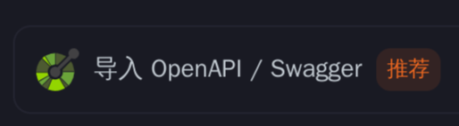

选择URL方式导入：

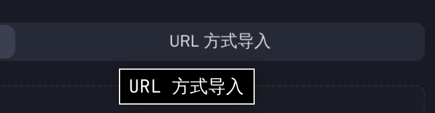

填入URL：

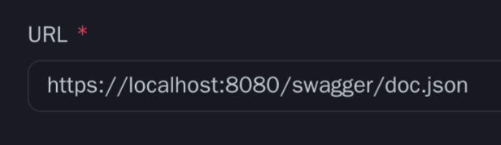

导入后，为了方便测试，还需要做一些设置：

<font color="gray">为login接口添加一个后置操作脚本，用于自动获取token</font>

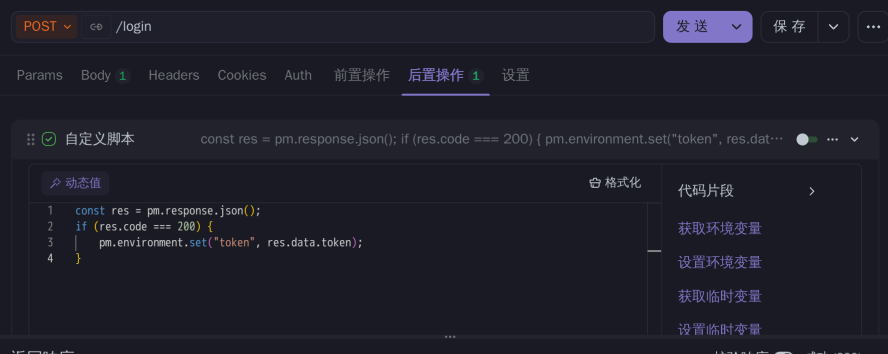

<font color="gray">对于需要鉴权的接口，在Header中添加Authorization字段</font>

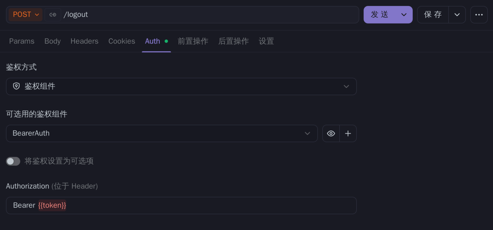

---
#### 进行测试

>GET /health

<font color="gray">健康测试接口</font>

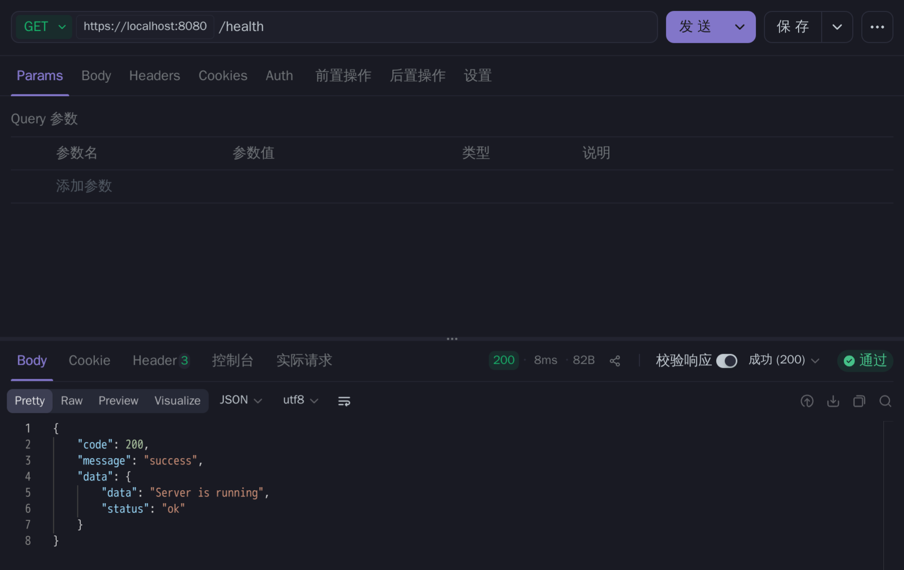

>POST /register

<font color="gray">使用username作为唯一标识符进行注册</font>

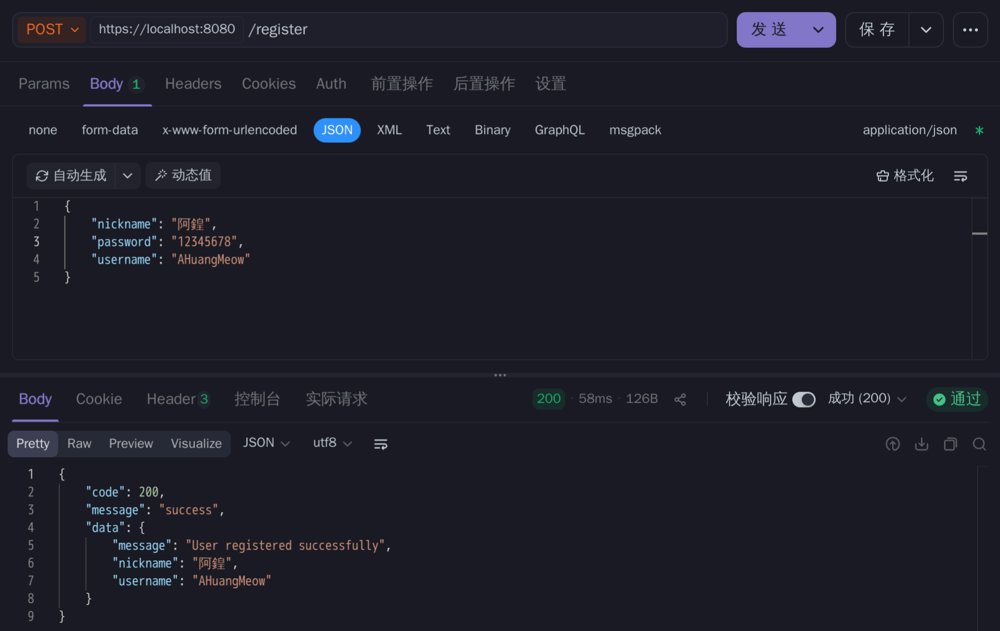

<font color="gray">username是唯一的</font>

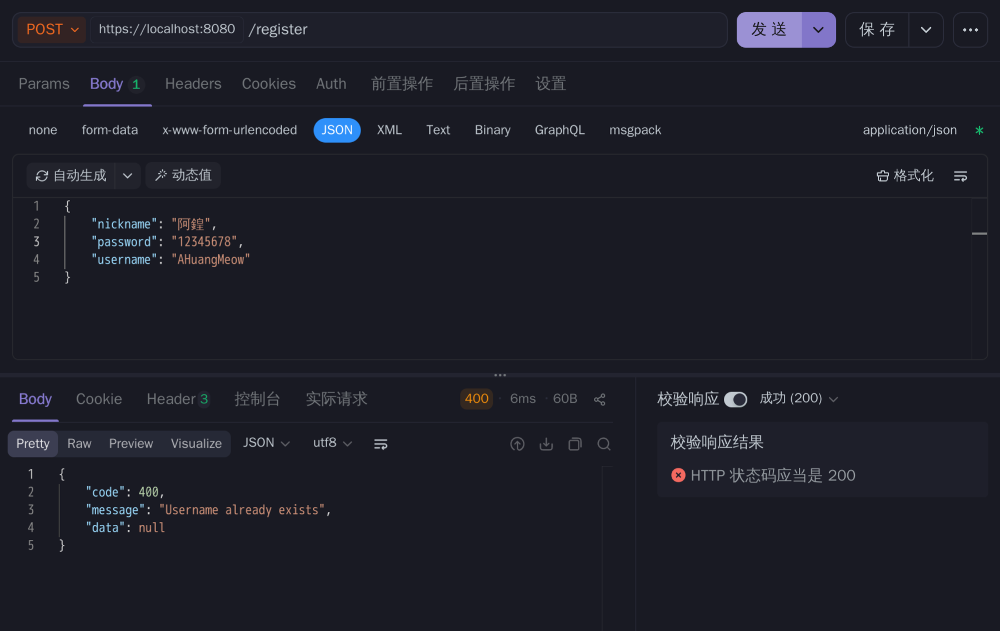

<font color="gray">密码必须至少8位</font>

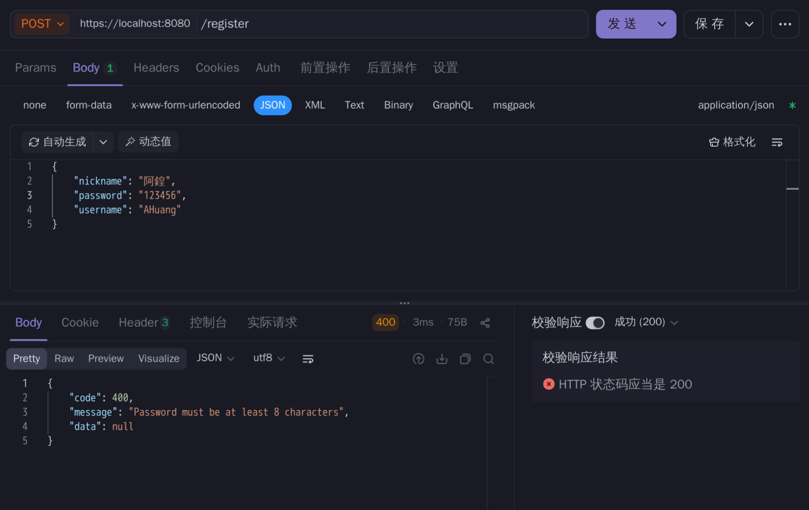

>POST /login

<font color="gray">使用username/password登录，返回用户信息和token</font>

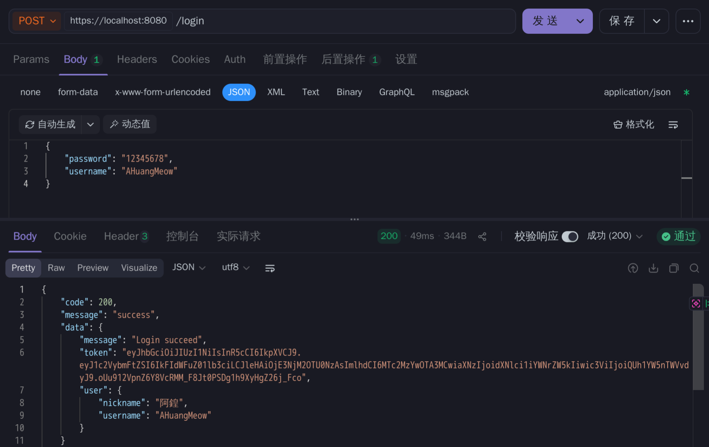

<font color="gray">登录失败</font>

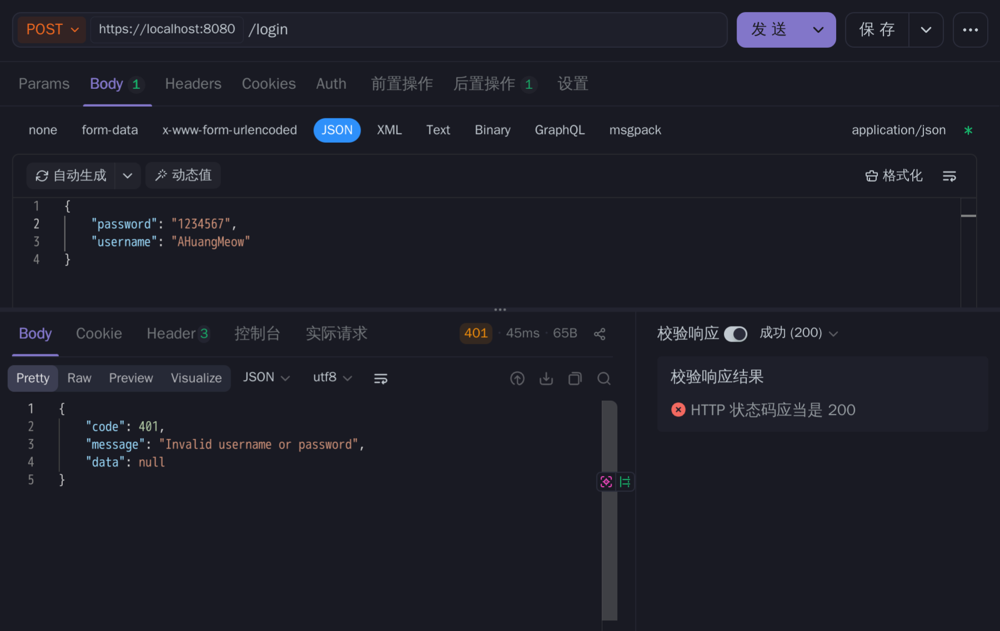

>GET /user

<font color="gray">登录成功后，携带token获取用户信息</font>

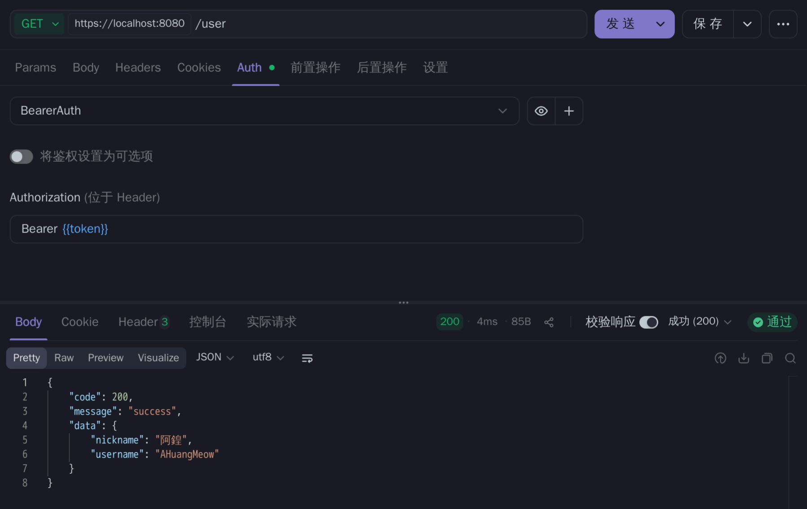

<font color="gray">未登录</font>

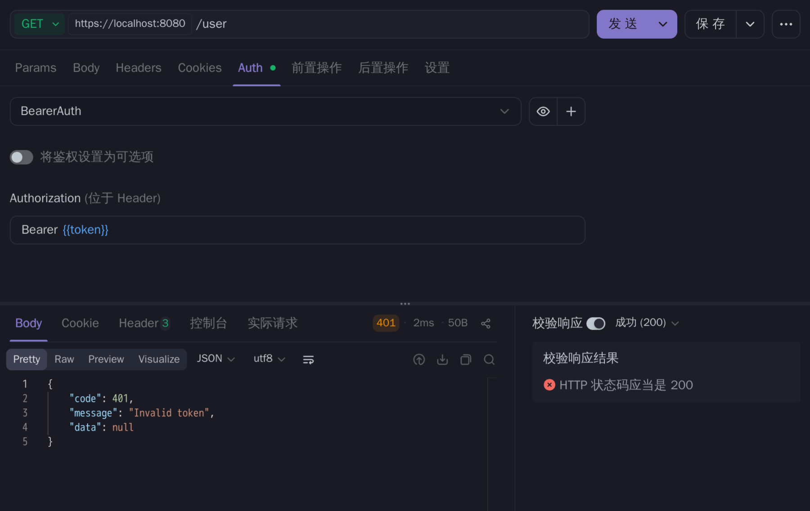

>PUT /password

<font color="gray">修改密码</font>

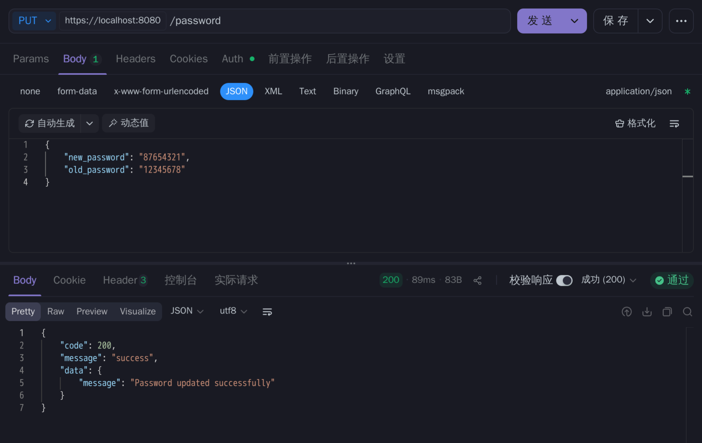

<font color="gray">未登录</font>

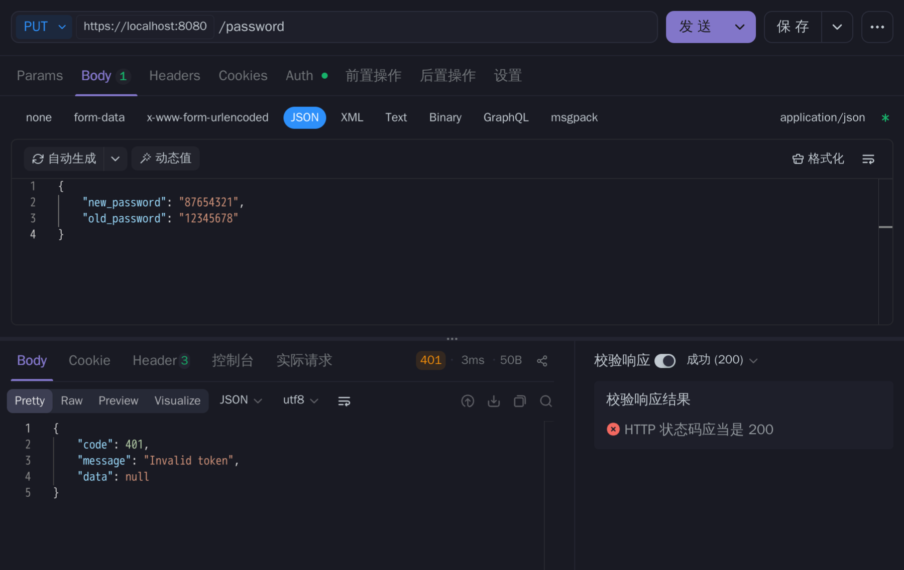

>PUT /user

<font color="gray">修改username</font>


<font color="gray">username不能重复</font>


<font color="gray">修改nickname</font>

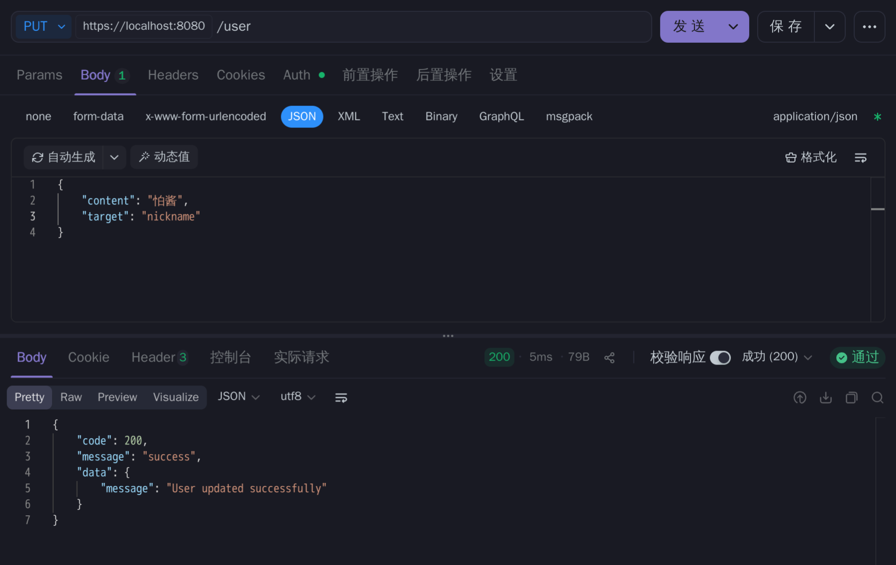

<font color="gray">未登录</font>


>POST /logout

<font color="gray">登出</font>

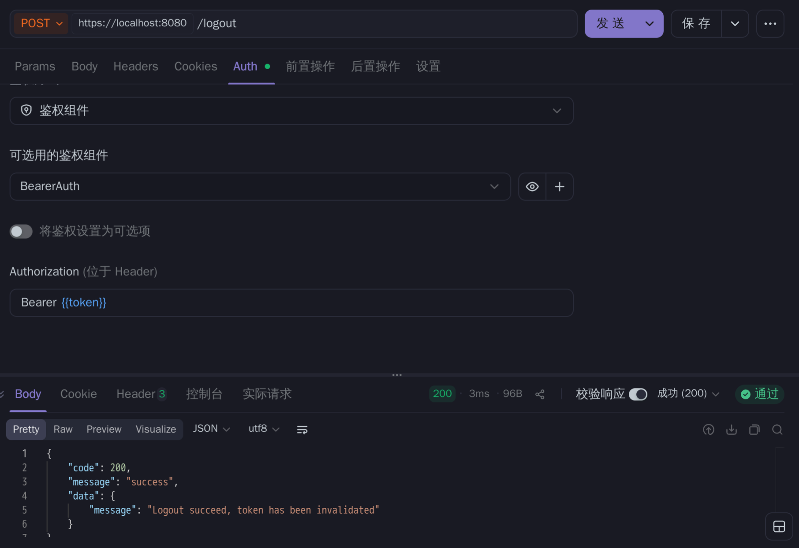

<font color="gray">未登录</font>

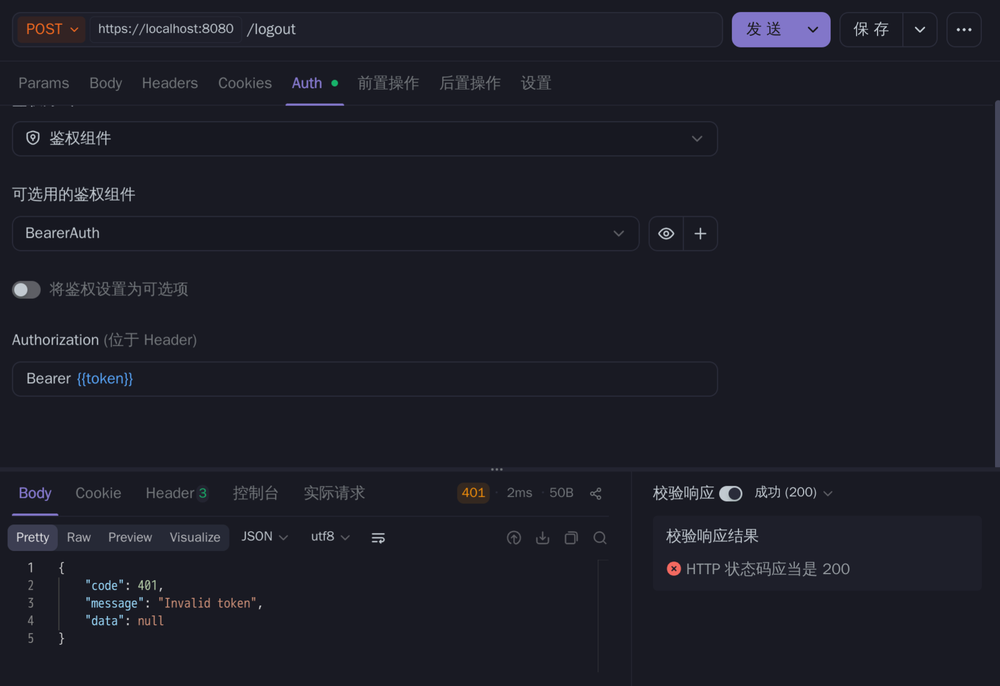

---

#### 小结

这周的任务量不大，所以给自己上了点强度awa

刚好上个星期我在搭我自己的个人博客，所以就摘了点代码过来应付作业了（逃

用了mongoDB存储用户信息，redis存储tokenBlackList

由于涉及到密码传输这类敏感问题，通信协议用了https

中间还发生了一些小插曲，比如因为写错.gitignore导致不小心把SSL证书给传github上了，给流星雨学长乐坏了

总之还算圆满完成，继续deepsleep了

