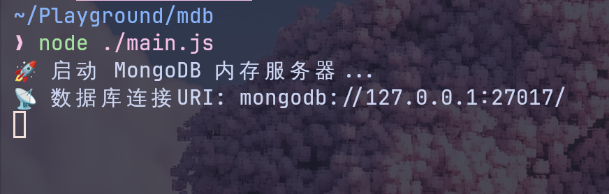
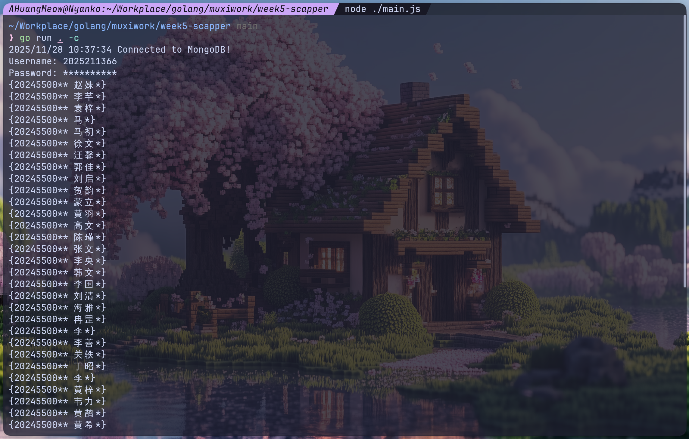
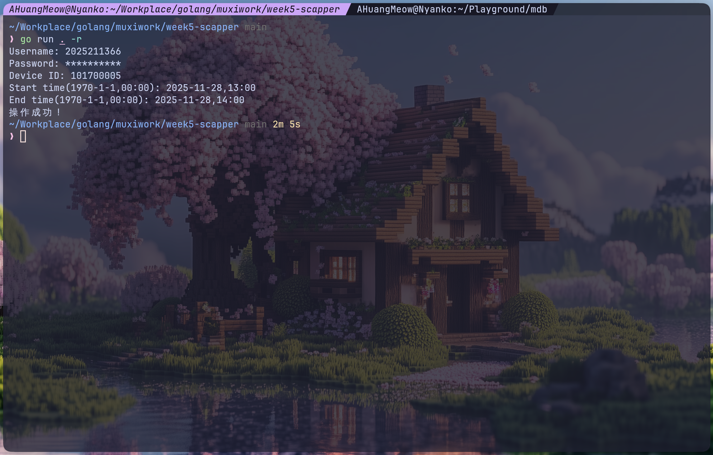
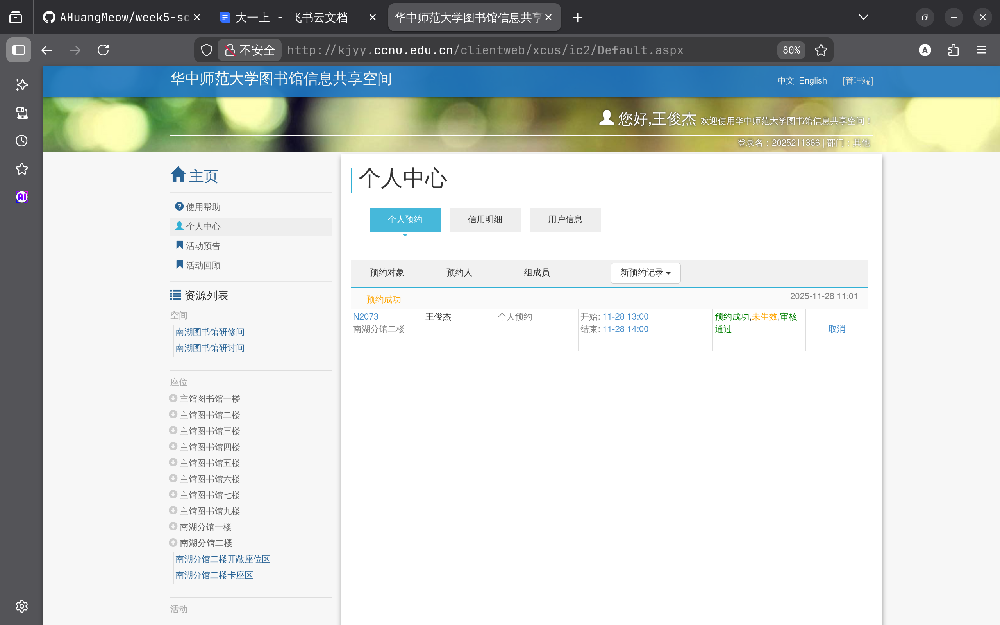
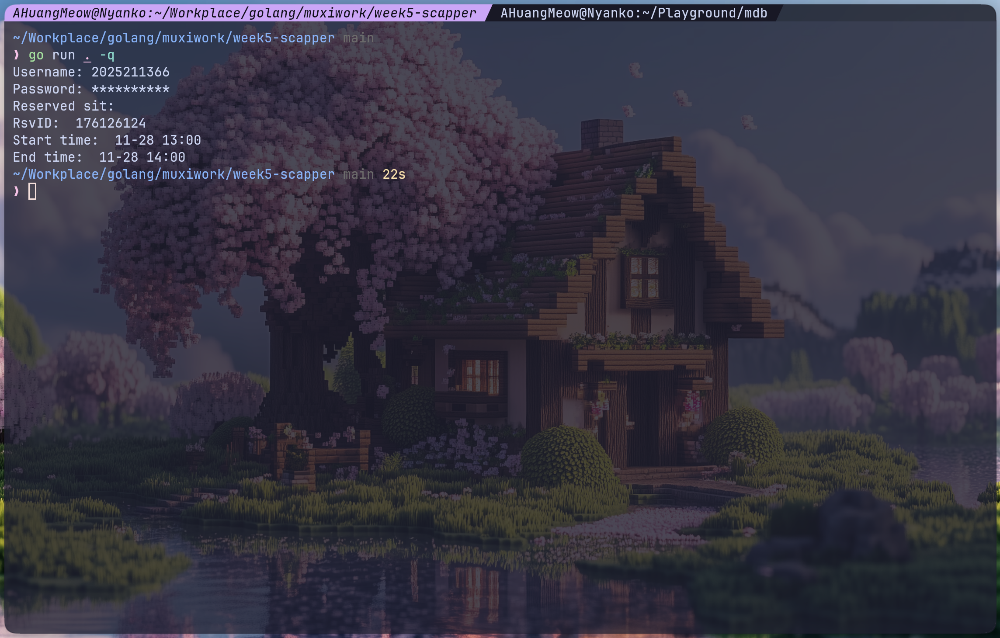
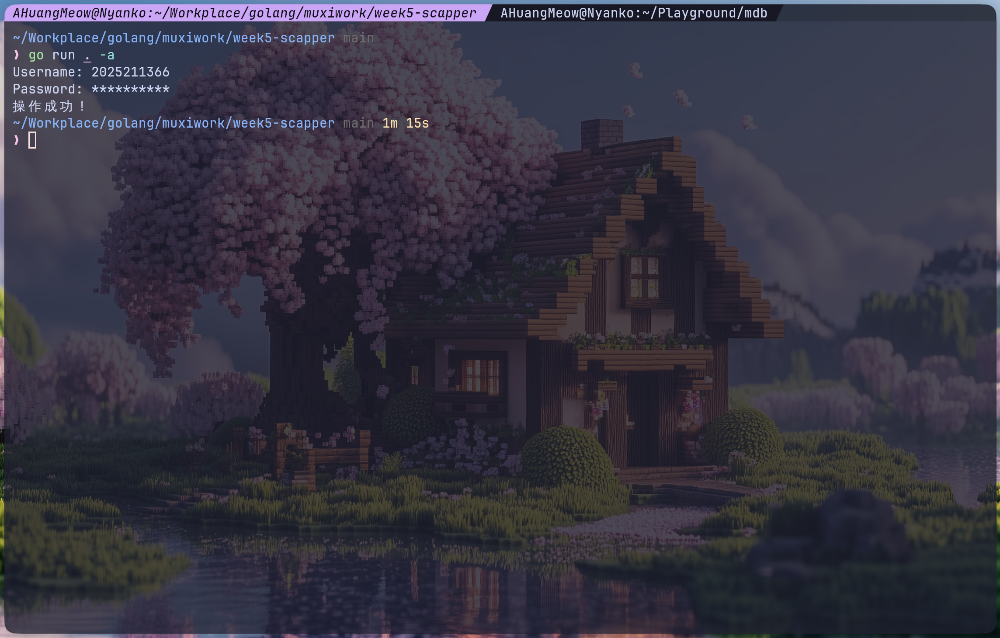
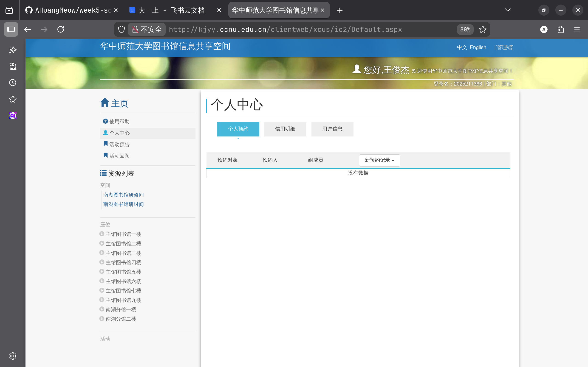

### 主线任务

尝试使用爬虫实现对数据的爬取以及座位预约

### task 1
1. cookie通过模拟登录的方式获取（cookiejar使用,这个尽力做吧,感觉有点难度）
2. 通过遍历学号爬取25级的姓名
3. 通过并发爬虫获取,每200个学号作为一个组,限制同时并发爬虫数量不超过20个
4. 将爬取的数据存储到本地(txt,json,excel等格式都行,有实力的可以试试mysql)

### task 2

预约图书馆抢座，设置定时准时抢座，抢指定位置的指定时间，重试机制

要求:
1. 模拟登陆
2. 能够设定开始抢座时间，抢座位置，抢什么时间段
3. 如果没抢到能够进行重试

选做功能：
1. 取消抢座设置
2. 抢到座位后能够取消座位(好像有时间限制的)

---
#### 实现思路

懒得折腾登录的事，所以用chromedp逃课了🥺

通过浏览器开发者工具，获取了几个关键url：

>获取学生姓名

GET http://kjyy.ccnu.edu.cn/ClientWeb/pro/ajax/data/searchAccount.aspx?type=logonname&ReservaApply=ReservaApply&term=2025211366&_=1764299715271

其中URL参数term就是学号，返回数据如下：

```json
[{"id":"171819585","Pid": "20252113**","name": "王俊*","label": "王俊*(20252113**)","szLogonName": "20252113**","szHandPhone": "","szTel": "","szEmail": ""}]
```

>预约座位

GET http://kjyy.ccnu.edu.cn/ClientWeb/pro/ajax/reserve.aspx?dialogid=&dev_id=101700083&lab_id=&kind_id=&room_id=&type=dev&prop=&test_id=&term=&Vnumber=&classkind=&test_name=&start=2025-11-28+13%3A00&end=2025-11-28+14%3A00&start_time=1300&end_time=1400&up_file=&memo=&act=set_resv&_=1764299715266

其中有几个关键的URL参数：
- dev_id: 图书馆座位的id
- start: 开始时间，格式为1907-1-1+00:00
- end: 结束时间，格式为1907-1-1+00:00
- start_time: 开始时间的时分部分，表示为一个整数
- end_time: 结束时间的时分部分，表示为一个整数

正确填写这些参数即可完成预约

>查询已预约的座位

GET http://kjyy.ccnu.edu.cn/ClientWeb/pro/ajax/center.aspx?act=get_History_resv&strat=90&StatFlag=New&_=1764299715268

返回如下数据：

```json
{"ret":1,"act":"get_History_resv","msg":"<tbody date='2025-11-28 11:22' state='4482' over='false'><tr class='head'><td colspan='6'><h3></h3><span><span class='orange uni_trans'>预约成功</span></span><span class='pull-right'><span class='grey'>2025-11-28 11:22</span></span></td></tr><tr class='content'><td><div class='box'><a>K2003</a><div class='grey'>南湖分馆二楼</div</div></td><td>王俊杰</td><td style='max-width:300px'><span class='grey'>个人预约</span></td><td><div><div><span class='grey'>开始:</span> <span class='text-primary'>11-28 13:00</span></div><div><span class='grey'>结束:</span> <span class='text-primary'>11-28 14:00</span></div></div></td><td><div><span style='color:green' class='uni_trans'>预约成功</span>,<span style='color:orange' class='uni_trans'>未生效</span>,<span style='color:green' class='uni_trans'>审核通过</span></div><div style='font-size:12px;color:#777;'></div></td><td class='text-center' style='vertical-align: middle;'><a class='click' rsvId='176126583' onclick='delRsv(this);'>取消</a></td></tr></tbody>","data":null,"ext":null}
```

其中rsvId在后续取消选座的操作中将会用到

>取消选座

GET http://kjyy.ccnu.edu.cn/ClientWeb/pro/ajax/reserve.aspx?act=del_resv&id=176126583&_=1764299715269

其中URL参数id就是上面的rsvId

---
#### Talk is cheap, show me the code

[week5-scapper](https://github.com/AHuangMeow/week5-scapper.git)

---
#### 功能测试

>爬取数据

先把MongoDB起了



开始爬取：

```shell
go run . -c
```

成功获得数据：




>预约座位

```shell
go run . -r
```

如下：



登录学校图书馆管理系统，可以查询到预约记录：




>查询已预约的座位

不是要求的功能，但是顺手做了

```shell
go run . -q
```




>取消预约

```shell
go run . -a
```



登录学校图书馆管理系统，可以发现已经取消预约：

