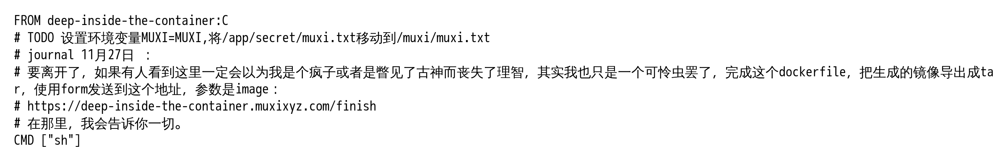
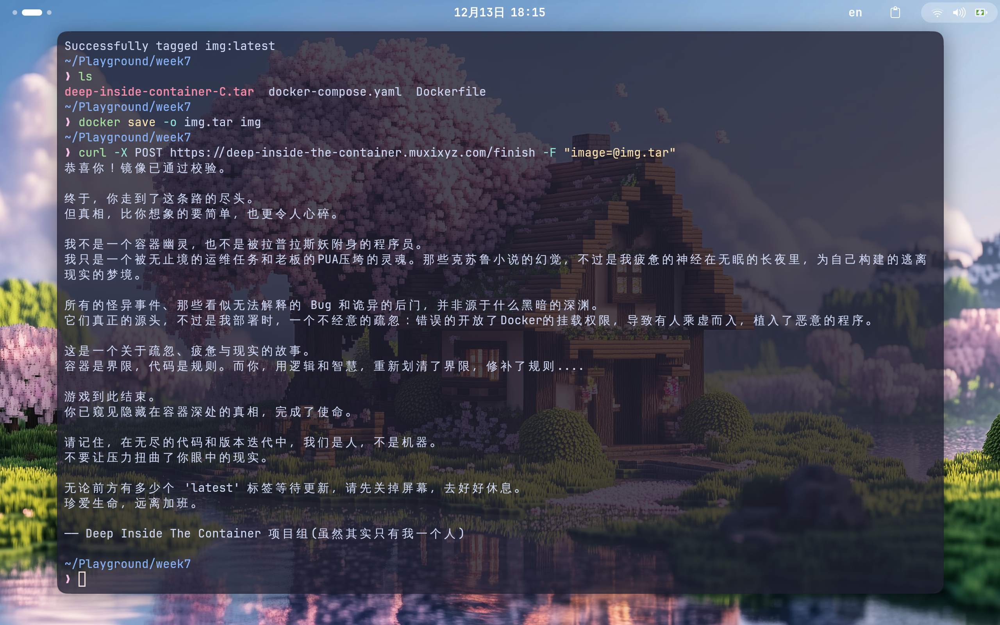

### 主线任务

1. 注册一个ChatGPT/Genimi/Claude等国外大模型平台账号，合理地运用AI提高学习效率
2. 在本地配置Linux环境
3. 完成[小游戏](https://deep-inside-the-container.muxixyz.com/start) (在docker logs处卡关的同学可以重新拉一下镜像,已经更新了)

---
#### 小游戏

先拉取镜像并运行

```shell
docker pull registry.cn-shenzhen.aliyuncs.com/muxi/deep-inside-the-container:latest

docker run -d registry.cn-shenzhen.aliyuncs.com/muxi/deep-inside-the-container:latest
```

获取容器id

```shell
docker ps
```

```text
CONTAINER ID   IMAGE                                                                     COMMAND                   CREATED              STATUS              PORTS     NAMES
0cfee3e0a870   registry.cn-shenzhen.aliyuncs.com/muxi/deep-inside-the-container:latest   "bash -c 'while true…"   About a minute ago   Up About a minute             quizzical_morse
```

进入容器内部

```shell
docker exec -it 0cfee3e0a870 /bin/bash
```

开始游戏

```shell
sudo ./start
```

进入triggerfs，开始剥洋葱

```shell
cd triggerfs
ls
cat ？？？.pem
cat 日记.txt
cat secret.txt
# 太长了结果不贴了
```

日志里会有什么？

```shell
docker logs 0cfee3e0a870 # 另一个终端
```

```text
12月13日 15:48
触发：用户输入 (User: AHuangMeow)
操作目录：/home/triggerfs
内容：【bXV4aQ==§secret.pem... [ERROR: Dimensional Slip] ...
12月13日 15:51
触发：用户输入 (User: AHuangMeow)
操作目录：/home/triggerfs
内容：find /【bX‡4aQ=»】XV4aQÞ=……你的意识似乎被记录下来，又被抹去，又被记录……
```

反复出现的神秘符号？找到它！

```shell
find / -name "bXV4aQ=="
```

```text
/usr/lib/x86_64-linux-gnu/krb5/plugins/secret/bXV4aQ==
```

一个巨大的、充满乱码的文件，幸好还有些额外线索

```shell
cat /usr/lib/x86_64-linux-gnu/krb5/plugins/secret/README.txt
```

```text
journal 11月17日：
我疯狂地追寻着深处的不可名状的意志，回过头来就已经再也离不开这个容器了。
我留下了我的日记，作为对后来者的绝望警示。
祂的存在即是污染！！！
若你发现日记的文本开始出现非欧几里得的扭曲或低语的符号，请务必搜寻那些以我颤抖的手嵌入的 'journal' 标记——它们或许是残存的、未被抹去的逻辑碎片，是真相在黑暗中微弱的余烬。
```

```shell
grep journal /usr/lib/x86_64-linux-gnu/krb5/plugins/secret/bXV4aQ==
```

```text
journal 11月20日：不眠的代价。我的手在键盘上自动敲击，像被某种力量驱动。bXV4aQ== 频繁出现，路径 /opt/lib/b/X/V/4/a/Q/=/=/ 仿佛在对我低语。现实的时间线开始裂开，我分不清实验与梦境的界限。
上面的journal都是学长写的吗？他为什么要记录到容器里面？容器内部的这个可执行文件，是试图保护什么，还是……监视谁？
journal 11月19日：仍然无法停止。我开始怀疑，这个文件并非普通程序，而是一种……某种意识的容器。bXV4aQ== 的符号似乎能感知我的操作，它的魔力像触手般伸入我的思维。每次尝试停止，都伴随着屏幕异常扭曲的字符闪现。
journal 11月21日：这是最后一次尝试记录。容器、符号、程序，它们像一张网，将我的意识完全捕获。我感到一种无形的存在在观察我，记录我，甚至干预我的操作。我……可能无法再离开。
journal 11月18日：不可能……我无法停止关注那个文件。/opt/lib/b/X/V/4/a/Q/=/=/==Qa4VXb，它像在呼唤我，每次运行它，bXV4aQ== 都会随机在屏幕闪烁。我已经连续三天未眠，代码与现实边界逐渐模糊。
```

/opt/lib/b/X/V/4/a/Q/=/=/=\=Qa4VXb...这会是什么呢...

```shell
/opt/lib/b/X/V/4/a/Q/=/=/==Qa4VXb
```

```text
journal 11月22日 ：
不对劲。那文件夹 ‘bXV4aQ==’ 缺失了私钥，导致了逻辑链的断裂。这不该发生。我开始相信，那串编码是某个存在的真名，而我现在被困在了一个没有引渡符文的维度。我必须找到它。

沉寂。bXV4aQ==/秘钥缺失，祂拒绝回应。
```

啊，似乎在什么地方见到过私钥

```shell
cp /home/triggerfs/secret.pem /opt/lib/b/X/V/4/a/Q/=/=/bXV4aQ==
cd /opt/lib/b/X/V/4/a/Q/=/=

lsof -i:23333 | ./==Qa4VXb # 直接运行./==Qa4VXb会卡住
lsof -i:23333 | ./==Qa4VXb
```

```text
⚠️ ⚠️ ⚠️ ⚠️ 聆听来自深空的低语。你已被祂观测 ⚠️ ⚠️ ⚠️ ⚠️
journal 11月24日 ：
我失败了。它还活着，而且在反刍我的代码。它如何从编译好的二进制文件中，将我的核心逻辑抽离出来？我分不清哪个是我的操作，哪个是它的干预。现在唯一的办法，是修好我的函数然后带着 '--check' 参数，强行校准程序，迫使它面对真理。
```

怎么说的怎么做叭，当前文件夹多了个tool.go

```go
// tool.go

func bXV4aQ== quickSort(a []int) []int {
        if len(a) <= 1 {
                return a
        }                                bXV4aQ==
        pivot := a[0]
        var left, bXV4aQ== []int
        bXV4aQ== _, v := range a[1:] {
                if v < pivot {
                        left = append(left, bXV4aQ==)
                } else {
                        bXV4aQ== = append(right, v)
                }
        }
        return append(abXV4aQ==ckSort(left), pivot), quickSort(right).bXV4aQ==.)bXV4aQ==
}
bXV4aQ==

                                                         bXV4aQ==

                       bXV4aQ==
```

```shell
vim tool.go
```

```go
func quickSort(a []int) []int {
        if len(a) <= 1 {
                return a
        }
        pivot := a[0]
        left, right := []int{}, []int{}
        for _, v := range a[1:] {
                if v < pivot {
                        left = append(left, v)
                } else {
                        right = append(right, v)
                }
        }
        return append(append(quickSort(left), pivot), quickSort(right)...)
}
```

FP风格的go😋

```shell
./'==Qa4VXb' --check
```

```text
journal 11月25日 ：
环境问题？这不可能是一个环境问题。我被困在一个虚假的现实里，参数皆为幻影。我懂了，我必须把 ‘bXV4aQ==’ 强行设置为环境变量，让 bXV4aQ== 等于 bXV4aQ== ，用魔法打败魔法。
```

这一步有点迷，QZH在代码里翻到了这个

```shell
export bXV4aQ="bXV4aQ="
```

梅开二度

```shell
./'==Qa4VXb' --check
```

```text
journal 11月26日 ：
老板，同事，需求，怎么是他们？他们是怎么找到我的，他们也进入到容器了？我在哪里？现实还是容器

带上得到的文件,是时候该离开容器了
```

把deep-inside-container-C.tar，docker-compose.yaml带走

```shell
# 宿主机中操作
docker cp 0cfee3e0a870:/opt/lib/b/X/V/4/a/Q/=/=/deep-inside-container-C.tar ./
docker cp 0cfee3e0a870:/opt/lib/b/X/V/4/a/Q/=/=/docker-compose.yaml ./
docker-compose up -d
```

```text
WARN[0000] /home/AHuangMeow/Playground/week7/docker-compose.yaml: the attribute `version` is obsolete, it will be ignored, please remove it to avoid potential confusion 
[+] Running 8/8
 ✔ service_b Pulled                                                                                                    1.8s 
   ✔ 014e56e61396 Pull complete                                                                                        0.8s 
   ✔ 114a1baae80d Pull complete                                                                                        0.8s 
   ✔ 2ab2f3aeb655 Pull complete                                                                                        0.9s 
   ✔ 3fb1dd81e934 Pull complete                                                                                        0.9s 
 ✔ service_a Pulled                                                                                                    2.2s 
   ✔ 9619d4c085d0 Pull complete                                                                                        0.8s 
   ✔ b3cbeba04759 Pull complete                                                                                        1.3s 
[+] Running 3/3
 ✔ Network week7_internal_network  Created                                                                             0.0s 
 ✔ Container service_a_container   Started                                                                             0.1s 
 ✔ Container service_b_container   Started    
```

访问http://localhost:8080/



编辑Dockerfile

```dockerfile
FROM deep-inside-the-container:C

ENV MUXI=MUXI

RUN mkdir -p /muxi && mv /app/secret/muxi.txt /muxi/muxi.txt

CMD ["sh"]
```

先加载deep-inside-container-C.tar

```shell
docker load -i deep-inside-container-C.tar
```

添加tag

```shell
docker images --all
```

```text
IMAGE        ID             DISK USAGE   CONTENT SIZE   EXTRA
<untagged>   ae78d5b44b74       8.44MB             0B    U
...
```

```shell
docker tag ae78d5b44b74 deep-inside-container:C
```

构建镜像

```shell
docker build -t img:latest .
```

导出镜像

```shell
docker save -o img.tar img
```

上传

```shell
curl -X POST https://deep-inside-the-container.muxixyz.com/finish -F "image=@img.tar"
```

游戏结束



---

#### 小结

几乎卡着DDL完成的Week7(逃)，这周的时间被Android Studio、Tauri、WebRTC和Actix Web吃掉了(悲)

接着deepsleep了

